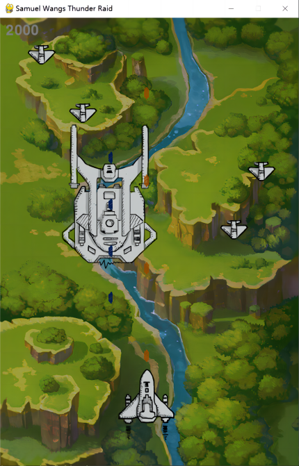
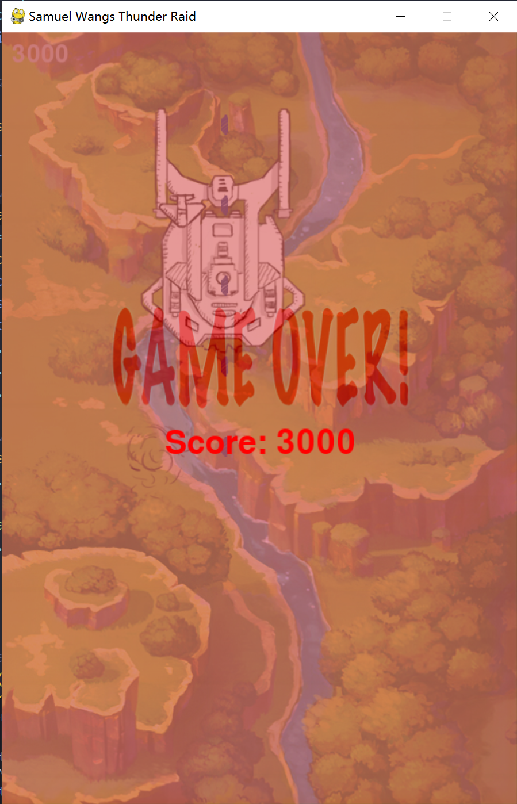

# COGS-18-Final-Project
## Project Description
Project: Samuel Wangs Thunder Raid

- It's a shmups(Shoot'em up) like two-player game. 
- One side is the attacker, the other is the defender. If the defender's side's little defender hit the attacker, the game is over. 
- The goal for attacker is to destory the random generated little defender as much as possible to gain a higher score.
- The goal for defender is to use its bullets to counteract the attacker's bullets to defend the little defender, but not to directly destroy the attacker!!!!!! 
- The bullet of defender will only counteract attcker's bullets! not destory it!!!!!!!
- The player can control the attacker with 'W A S D' and the defender with '↑ ↓ ← →'

Why I made this game:

- Firstly, I want use what I have learned in COGS18 to build my game by using OOP(object oriented programming) with a third party library - pygame.
- By integrating the classes, including the attacker, the defender, the enemies and the bullets, and the Pygame, I gain more profound comprehension of python programming.
- Also, the game itself is fun to play with my friends. I can keep on adding more elements in the game to make it more fun, like add some supplement, the HP system and even more kinds of enemies.
## ScreenShot

  
   

## Approach
1. You use relevant modules (from standard library and external sources):
- I realize this game with basic OOP and pygame, they are necessary for this game. Using class as object ensures the low complexity of coding and pygame lib provides the essential methods to build a game, including the input of songs and images and the process of collision between objects, like the bullets and the plane.
2. The algorithms / approaches used are well chosen for the task at hand:
- Every function in my project is not redundant, the movement of each elements, the process of collision between objects and the control of frequency of generating elements are all adjustable. I only use basic pygame method and python loops and conditions to build the game.
3. The algorithms / approaches chosen are properly implemented:
- I've tried my best to read and to understand the documentations of pygame to make my project consice and robust.
## Extra:
1. Your Python Background?
- I've learned java, html, css before, but never used python to write any program, so it's my first python project. But I already familiar with OOP and data structures before taking COGS 18.
2. How your project went above and beyond the requirements of the project and/or how you challenged yourself to learn something new with the final project
- I challenged myself to learn a new third party lib pygame to make a playable game. Also, I combined the pygame with the basic OOP programming and used the modular design to write my code. I start my project with a rough skeleton, including the class and the function that I want to include. And I follow the cycle to realize each of the class and their functions and keep improving them.
- The most harderst part for me is to find a easy method to limit the movement of the elements in the visible space. Although the algorithm seems easy now, but it's hard for me to find the correct way.
